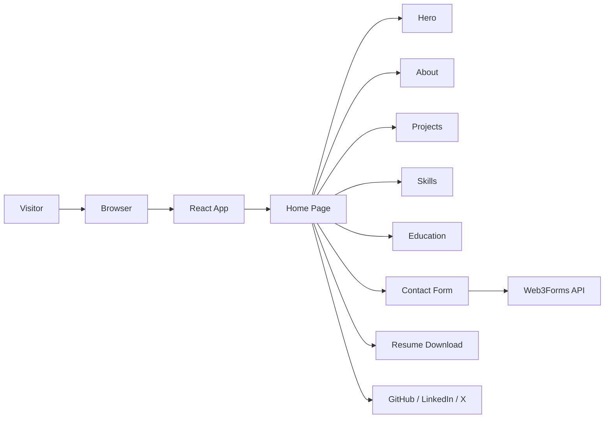
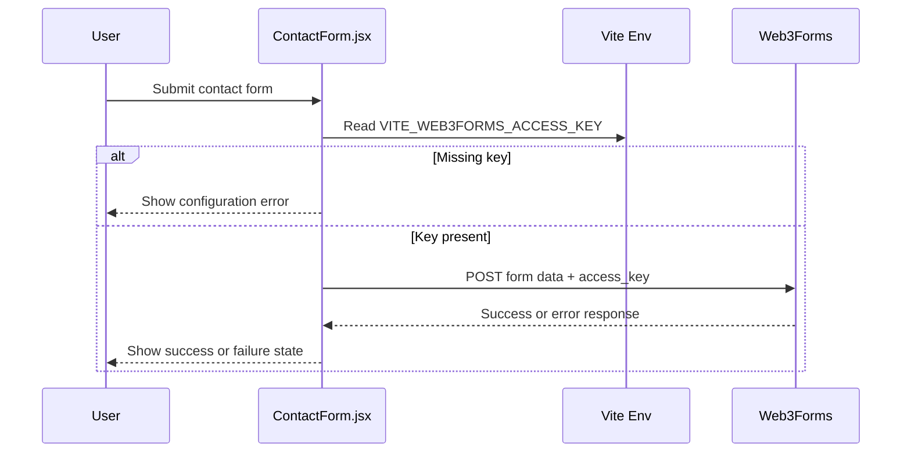

# Vivek Kumar Portfolio

A personal portfolio website built with React, Vite, and Tailwind CSS to present the developer's profile, projects, skills, education, and contact information. The project focuses on a modern, responsive, single-page experience with a professional developer brand aesthetic and a working contact form powered by Web3Forms.

## Overview

This portfolio is a front-end application designed to showcase Vivek Kumar's work as a front-end developer. It presents a clear professional narrative through a hero section, about section, project showcase, skills overview, education timeline, and a contact form. The app is built as a static portfolio experience with reusable components and responsive layouts for desktop and mobile devices.

The implementation is centered around React 19 and Vite, with Tailwind CSS used for utility-based styling and custom CSS handling additional layout and animation behavior. The portfolio also includes resume download actions, social profile links, and a contact form submission flow that sends requests to Web3Forms using a Vite environment variable.

## Features

- Responsive single-page portfolio layout
- Hero section with profile summary and primary calls to action
- Resume download functionality
- Social profile links for GitHub, LinkedIn, and X/Twitter
- About section describing the developer profile and focus areas
- Projects showcase with cards, technologies, live demos, and source links
- Skills section with category-based skill grouping and animated circular progress indicators
- Education and training section with certification verification buttons
- Contact form with submission success and error states
- Loader screen with animated progress and branding intro
- Tailwind-based styling with custom layout and animation CSS

## Tech Stack

### Frontend
- React 19
- Vite
- JavaScript
- Tailwind CSS

### Styling
- Tailwind CSS
- Custom CSS in App.css and index.css
- Google Fonts (Poppins)

### Contact Form
- Web3Forms API

### Development Tools
- ESLint
- Vite React plugin
- @tailwindcss/vite plugin

## Project Architecture

This is a client-side portfolio application with a component-driven architecture. The main app mounts a `Home` page, which renders the portfolio sections in order: loader, navbar, hero, about, projects, skills, education, contact form, and footer.

The code is organized around reusable UI sections and layout components rather than a backend-driven architecture. There is no database, authentication system, or server-side application layer in the current implementation.



## Project Structure

```text
Portfolio/
├── README.md
├── VivekPortfolio/
│   ├── .env.example
│   ├── .gitignore
│   ├── eslint.config.js
│   ├── index.html
│   ├── package.json
│   ├── vite.config.js
│   ├── public/
│   │   ├── robots.txt
│   │   └── sitemap.xml
│   └── src/
│       ├── App.css
│       ├── App.jsx
│       ├── index.css
│       ├── main.jsx
│       ├── assets/
│       │   ├── profile.PNG
│       │   ├── portfolio.PNG
│       │   ├── resume.svg
│       │   ├── contactImage.PNG
│       │   ├── certificate1.jpeg
│       │   ├── certificate2.jpeg
│       │   ├── Vivek-Kumar_Frontend_Developer_Resume.pdf
│       │   └── ...
│       ├── Components/
│       │   ├── Common/
│       │   │   └── Loader.jsx
│       │   ├── Layout/
│       │   │   ├── Footer.jsx
│       │   │   └── Navbar.jsx
│       │   └── Sections/
│       │       ├── About.jsx
│       │       ├── ContactForm.jsx
│       │       ├── Education.jsx
│       │       ├── Hero.jsx
│       │       ├── Project.jsx
│       │       └── Skills.jsx
│       └── Pages/
│           └── Home.jsx
```

### Key directories
- `src/Components/Sections/`: Main page sections for the portfolio experience.
- `src/Components/Layout/`: Shared layout elements such as the header and footer.
- `src/Components/Common/`: Common UI elements like the loader.
- `src/Pages/Home.jsx`: Page assembly for the main portfolio layout.
- `src/assets/`: Local images, icons, and resume PDF used throughout the app.

## Application Flow

### Startup flow
1. The browser loads the Vite entry point in `src/main.jsx`.
2. The `App` component renders the `Home` page.
3. The `Home` page initializes the loader state, renders the navigation, and then loads all portfolio sections.
4. The user can scroll through the portfolio sections and interact with buttons, links, and the contact form.

### Contact form flow
1. The user fills in the name, email, subject, and message.
2. The form is submitted to the Web3Forms API endpoint.
3. The code reads `VITE_WEB3FORMS_ACCESS_KEY` from the environment.
4. On success, the UI switches to a professional success state.
5. On failure or missing configuration, it shows a failure message and allows the user to return to the form.



## Installation & Setup

### Prerequisites
- Node.js and npm installed on the local machine

### Clone the repository
```bash
git clone <repository-url>
cd Portfolio
```

### Install dependencies
```bash
cd VivekPortfolio
npm install
```

### Environment variables
Create a `.env` file inside `VivekPortfolio` with the required value:

```env
VITE_WEB3FORMS_ACCESS_KEY=your_web3forms_access_key
```

A template exists at `.env.example` in the app directory.

### Run locally
```bash
cd VivekPortfolio
npm run dev
```

### Production build
```bash
cd VivekPortfolio
npm run build
```

### Preview production build
```bash
cd VivekPortfolio
npm run preview
```

## Environment Variables

| Variable | Required | Description |
| --- | --- | --- |
| `VITE_WEB3FORMS_ACCESS_KEY` | Yes | Access key used by the contact form for sending messages through Web3Forms. |

## Usage

After starting the app, the user can:
- browse the portfolio sections from the landing page
- click the resume button to download the PDF
- open social links to GitHub, LinkedIn, and X/Twitter
- review project cards and open live/demo or source links
- submit a contact message using the form in the contact section

## Key Technical Implementation

- The app uses a component-driven React architecture with separate layout, section, and page components.
- The landing experience includes a loader with timed transitions and animated scanner effects.
- `Home.jsx` assembles the complete single-page experience using reusable section components.
- Navigation links use anchor-based scrolling to section IDs.
- External links open in a new browser tab using `window.open(..., '_blank', 'noopener,noreferrer')`.
- The contact form uses `FormData`, a fetch request, and Web3Forms to submit messages.
- The UI includes conditional success and error states after submission to improve the user experience.
- Responsive behavior is handled with Tailwind layout utilities and custom CSS media queries.

## Screenshots

No screenshots are currently stored in the repository as project assets for documentation. The application is designed to display portfolio sections directly in the browser.

## Future Improvements

- Add a proper multi-page routing setup if the portfolio grows beyond a single-page experience.
- Add a live backend or database-backed admin dashboard for managing projects and contact entries.
- Move reusable content into a structured data source to simplify updates.
- Add more advanced animations and scroll-triggered transitions.
- Add automated testing for UI and contact form behavior.
- Provide a dedicated deployment pipeline with environment-based production configuration.

## Challenges & Solutions

The project structure was reorganized into a more scalable component hierarchy, which required consistent import path updates across the app. To maintain clean organization, the project now separately groups layout, section, and common components, while keeping the portfolio page assembly centralized in `Home.jsx`.

The contact form also required careful handling of environment configuration and failure states, so the implementation checks for the Web3Forms access key before submission and provides clear user feedback if the key is missing or the request fails.

## Learning Outcomes

This project demonstrates:
- modern React component organization
- responsive portfolio design patterns
- working with Tailwind CSS in a real UI project
- creating polished user interfaces with custom styling and animation
- integrating third-party form submission via API access keys
- managing project assets and digital resume downloads in a frontend app

## Contributing

Contributions are welcome if they improve the project quality, responsiveness, or developer experience. A typical contribution workflow would be:

1. Fork the repository
2. Create a feature branch
3. Make the needed changes
4. Run the project locally with the development server
5. Validate the build with `npm run build`
6. Open a pull request with a clear summary of the change

## License

No explicit license file was found in the repository, so no license is currently specified for this project.

## Author

Vivek Kumar
